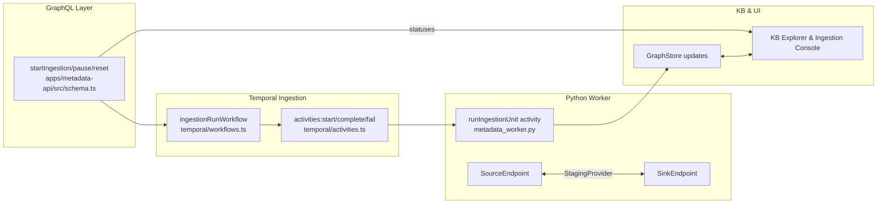

# Nucleus Architecture Map

## Overview

Nucleus stitches together three main planes:

1. **Endpoint & Metadata plane** – Python (Spark) collectors reach into JDBC/HTTP sources, normalize payloads, and persist MetadataRecords.
2. **Temporal-driven ingestion plane** – Node/TypeScript workflows orchestrate per-unit incremental syncs via drivers + sinks.
3. **API & Console plane** – GraphQL (apps/metadata-api) exposes collections, catalog, KB, and ingestion controls that feed the React console.

### Metadata Collection Flow

```mermaid
flowchart LR
  subgraph Source Endpoints
    A[DescribedEndpoint<br>(runtime_common/endpoints/*)]
  end
  subgraph Execution Tools
    B[ExecutionTool/SQLAlchemyTool<br>(runtime_common/tools/*)]
  end
  subgraph Metadata Service
    C[collector.py & engine.py<br>(metadata_service)]
    D[Normalizers/Adapters<br>(metadata_service/normalizers/*)]
  end
  subgraph Temporal Worker
    E[metadata_worker.py]
  end
  subgraph Persistence
    F[metadata_gateway/gateway.py]
    G[Prisma metadata schema]
  end
  subgraph Surfaces
    H[apps/metadata-api GraphQL]
    I[apps/metadata-ui Console]
  end

  A -->|descriptor/config| B --> C
  C --> D --> C
  C --> E --> F --> G --> H --> I
  H -->|collections/catalog queries| I
```

### Ingestion & KB Flow



## Key Modules by Area

### Endpoint plane (platform/spark-ingestion)

- `runtime_common/endpoints/base.py` – Endpoint protocols (SourceEndpoint, SinkEndpoint, MetadataCapableEndpoint), descriptor metadata (fields, capabilities), registry helper.
- `runtime_common/endpoints/registry.py` – Registers concrete templates (`jdbc.postgres`, `jdbc.oracle`, `http.rest`, `stream.kafka`, etc.) for UI discovery.
- `runtime_common/endpoints/jdbc*.py`, `http_rest.py`, `stream_kafka.py` – Concrete SourceEndpoint implementations; JDBC subclasses flip on metadata support via MetadataSubsystems.
- `metadata_service/collector.py` & `metadata_service/engine.py` – Build `MetadataCollectionService`, drive snapshots via configured endpoints and guardrails.
- `metadata_service/normalizers/*` & `metadata_service/adapters/*` – Vendor-specific normalizers (Oracle/Postgres) convert raw catalog data into `CatalogSnapshot`.
- `metadata_worker.py` – Temporal worker entrypoint: expands tables, invokes collector, emits records, uploads manifests.
- `metadata_gateway/gateway.py` – Persists catalog records + metadata runs through Prisma with retry/metrics.
- `prisma/metadata/schema.prisma` – Data model (MetadataProject, MetadataEndpoint, MetadataRecord, MetadataCollection, MetadataCollectionRun, MetadataDomain, IngestionUnitState).

### Ingestion & sinks (apps/metadata-api)

- Core interfaces defined in `packages/metadata-core/src/index.ts` (`IngestionDriver`, `IngestionSink`, `IngestionCheckpointRecord`, `NormalizedRecord`).
- Temporal wiring in `apps/metadata-api/src/temporal/workflows.ts` (`ingestionRunWorkflow`) + `temporal/activities.ts` (start/sync/fail ingestion run).
- Runtime plumbing: `apps/metadata-api/src/ingestion/*` (checkpoint helpers, driver resolver, KB sink, Prisma `stateStore`).
- GraphQL surfaces in `apps/metadata-api/src/schema.ts` (types `IngestionUnit`, `IngestionStatus`, queries/mutations to manage runs).

### API & Console

- GraphQL schema/resolvers: `apps/metadata-api/src/schema.ts` (metadata catalog, endpoints, collections, KB nodes/edges/scenes, ingestion).
- Temporal activities for metadata collection: `apps/metadata-api/src/temporal/activities.ts` (collectionRunWorkflow, preview).
- UI shell: `apps/metadata-ui/src/App.tsx` routes between Metadata workspace, KB console, Ingestion console.
- Metadata workspace (endpoint registration, catalog view): `apps/metadata-ui/src/metadata/MetadataWorkspace.tsx` plus hooks/queries.
- KB console/explorers: `apps/metadata-ui/src/knowledge-base/*`.
- Ingestion console (admin view): `apps/metadata-ui/src/ingestion/IngestionConsole.tsx`.

### Specs & ADRs

- `docs/meta/ADR-UI-Actions-and-States.md` – Async action feedback contract (local + global cues).
- `docs/meta/ADR-Data-Loading-and-Pagination.md` – SWR-style keep-previous-data requirements for paginated lists.
- `intents/ingestion-core-v1` – Defines ingestion driver/sink contracts, GraphQL surfaces, and UI done criteria.
- `intents/semantic-sources-trio-story-v1` – Specifies future semantic-aware endpoints/sinks (Jira/Confluence/OneDrive).
- `intents/catalog-view-and-ux-v1` & `kb-*` – Outline catalog/Kb UI expectations reused today.

## Glossary (with references)

- **Endpoint / SourceEndpoint** (`runtime_common/endpoints/base.py`): Protocol describing how collectors talk to systems (JDBC, HTTP, stream). Provides descriptor metadata for UI templates.
- **SinkEndpoint** (`.../base.py`, `hdfs/parquet.py`): Target that receives ingested data (RAW/Hive landing). Currently used in Spark ingestion pipeline; TypeScript ingestion core uses `IngestionSink` abstraction instead.
- **MetadataSubsystem** (`metadata_service/adapters/*`): Vendor-specific adapter that knows how to extract catalog metadata from an endpoint and emit `CatalogSnapshot`.
- **Normalizer** (`metadata_service/normalizers/*`): Shapes adapter output into canonical dataset/source/process/ownership objects before persistence.
- **Metadata Collection vs Ingestion**: Collection = Spark/Temporal job that walks JDBC schemas and writes `MetadataRecord`s (`metadata_worker.py` / collectionRunWorkflow). Ingestion = new incremental sync path via `ingestionRunWorkflow` that processes vendor units through drivers/sinks to KB/CDM.
- **Driver (IngestionDriver)** (`packages/metadata-core/src/index.ts`): Interface that lists units for an endpoint and emits normalized batches along with checkpoints/stats.
- **Sink (IngestionSink)** (`packages/metadata-core/src/index.ts`, KB sink module): Receives normalized batches (records + edges) and persists to GraphStore or other systems.
- **GraphStore / KB** (`packages/metadata-core/src/index.ts`, `apps/metadata-api/src/schema.ts`): Logical graph built on top of metadata store; nodes/edges accessible via KB GraphQL queries and KB React console.
- **Collection vs Signal**: Collection writes catalog metadata snapshots. Signals (planned in semantic intents) are streaming-style events (`entity.work.item.*`) yet to be implemented.

## Drift / Gaps

- **Semantic GraphQL surfaces** – `intents/semantic-sources-trio-story-v1` + `docs/nucleus/semantic-sources/GRAPHQL-INGESTION-API.md` specify `semanticUnits`, `ingestionStatus` variants for Jira/Confluence/OneDrive, but `apps/metadata-api/src/schema.ts` currently exposes only generic `ingestionUnits/ingestionStatuses` and no semantic-specific domains.
- **Driver coverage** – Only `static` driver is registered (`apps/metadata-api/src/ingestion/staticDriver.ts`). Spec’d drivers for Jira/Confluence/OneDrive do not exist yet.
- **Sinks beyond KB** – ADR/spec call out JDBC/object/CDM sinks, but only `KnowledgeBaseSink` is implemented. Spark `SinkEndpoint`s (HDFS/Iceberg) exist separately but are not wired into the new ingestion-core.
- **Vector/indexing** – Semantic intents describe vector namespaces and signals, yet no vector ingestion or `index:*` capabilities exist in code today.
- CDM Explorer (Work + Docs): `apps/metadata-ui/src/cdm/CdmExplorerShell.tsx` hosts Work (`CdmWorkExplorer`) and Docs (`CdmDocsListView`) tabs backed by `cdmEntities`. Back-end envelope implemented in `apps/metadata-api/src/schema.ts` with data stores under `apps/metadata-api/src/cdm/*`.
